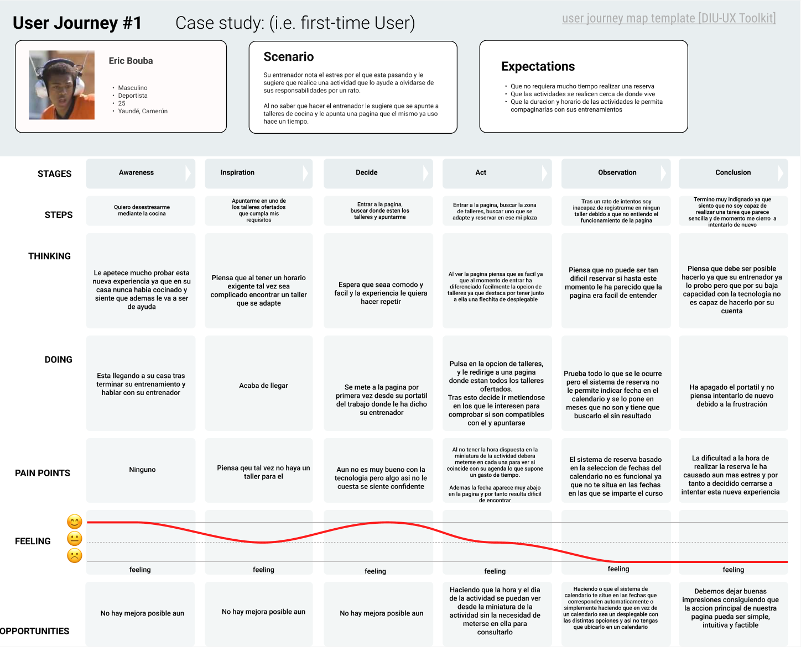

## Paso 1. UX User & Desk Research & Analisis 

 **1.a User Reseach Plan**
-----

El plan de este proyecto es recopilar información sobre cómo los usuarios organizan sus experiencias gastronómicas con el propósito de sacar una base de ideas e información para,
 en una etapa siguiente poder aplicar este conocimiento recopilado en el desarrollo de nuestro propio producto. Todo esto siguiendo diferentes tipos de metodos de estudio. Dicho plan
 queda explicado en [User Research Plan](User_Research_Plan.pdf).

 1.b Competitive Analysis
-----

Como ejemplos para el analisis de la competencia hemos elegido 3 paginas diferentes de experiencias gastronicas en granada, las dos que se proponen en el guion de la practica: 
PilsaEduca y Granada Cooking Expirience, junto a una que hemos investigado por nuestra cuenta denominada Aptitu que tambien ofrece talleres y es de Granada.

Hemos realizado un analisis de la competencia mediante una breve [Competitor Analysis](Competitor_Analysis.pdf) en la que comentamos sobre aspectos de distintas areas de interes con las que cuentan o no cuentan estas 
opciones y de tenerlas como de buenas son estas. Ademas de la explicacion se añade un aporte visual en el que se califica si es buena, regular o mala en dicho aspecto. 

Para el analisis que se va a realizar posteriormente hemos decidido elegir a Granada Cooking Experience como la propuesta a nalizar debido a que es en la que mas inconsistencias 
hemos encontrado y pensamos que es un buen caso de estudio para sacar conclusiones sobre lo que no se deberia hacer.

 1.c Persona
-----

Se han creado 2 personas ficticias para ser usadas a la hora de analizar la experiencia de un posible usuario interesado en la pagina elegida.

- **Marta Sanchez (Creada por Miguel Montiel Carrasco)**: una señora mayor que a su alta edad se ve sola y con mucho tiempo tras la muerte de su marido y busca experiencias que le permitan entretenerse y tener compañia.
- **[Eric Bouba](Eric_Bouba.png) (Creado por Daniel Fernández Jiménez)**: patinador profesional que fue fichado por su entrenador y ahora vive en Granada para poder entrenar y proseguir su carrera como patinador dejando el calor de su familia en Camerun, su tierra natal. Debido al estres que le produce su situacion busca una experiencia que le permita olvidarse de sus preocupaciones por un momento.

 1.d User Journey Map
----

- **Journey Map Marta Sanchez**:

- **[Journey Map Eric Bouba](Eric_Journey.png)**: EL propositode eric es el de apuntarse a uno de los talleres de cocina de Granada Cooking Experience que le ha propuesto su entrenador. La experiencia comienza bien ya que viniendo de un comentario positivo de su entrenador sobre la pagina le apetece mucho intentar probar esta nueva experiencia. Sin embargo, al intentar reservar por despiste y debido a su bajo nivel de entendimiento tecnologico, se le dificulta de primeras encontar la informacionm sobre el taller como puede ser la fecha que es la razon de su siguiente problema, ya que, al momento de intentar reservar mediante la funcion de calendario de la pagina es incapaz de ver fechas disponibles para dicho taller ya que el calendario comienza en el mes en el que se esta y no en el que transcurre el taller. Al no entenderlo y no ver ninguna forma de hacer la reserva se frustra y decide abandonar la idea.

 1.e Usability Review & Briefing
----

- **Enlace al documento**:  [Usability Review](Usability-review.pdf) 
- **Valoración final (numérica)**: 88

**Briefing**: hemos decidido analizar el caso de Granada Cooking Experience. Al momento de la valoracion hemos visto que dicha pagina tiene cualidades que en su mayoria estan muy bien y valoramos que esten pulidas y no generen problema. Sin embargo, tambien hemos encontrado cualidades que deberian cumplirse siempre como pueden ser los problemas a la hora de añadir o visualizar la cesta, opciones de busqueda que nos permitan encontrar lo que buscamos o el feedback general de la pagina.