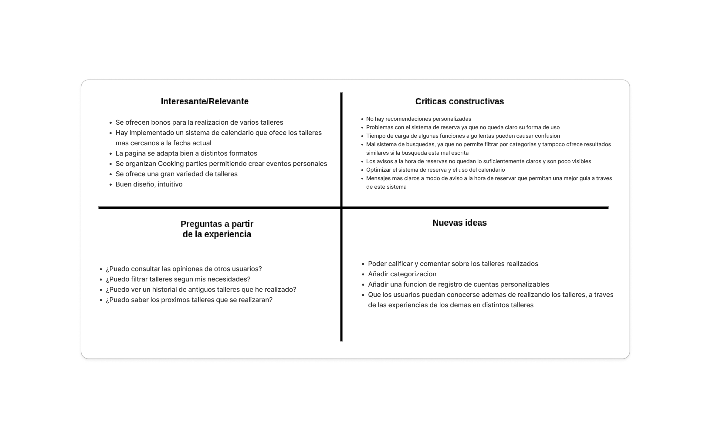
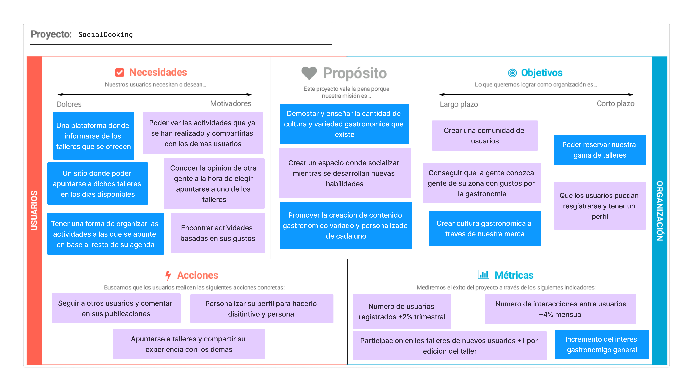
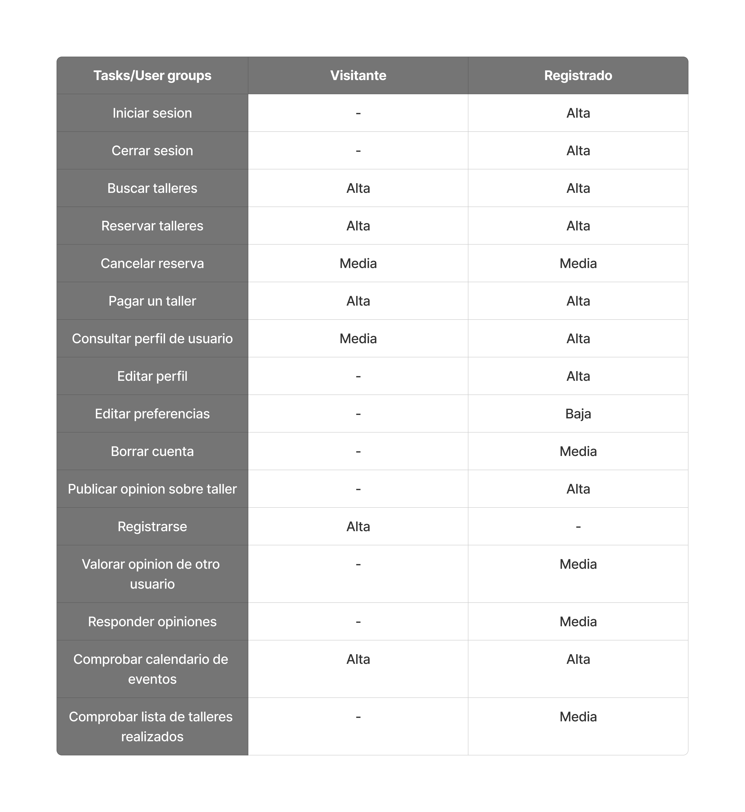
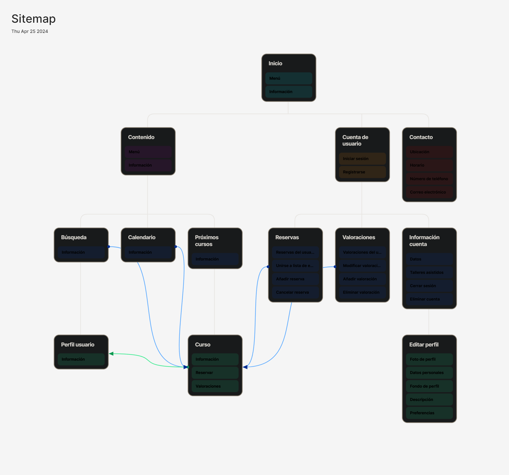

## Paso 2. UX Design  

 2.a Reframing / IDEACION: Feedback Capture Grid
----

En base a la informacion recabada en la anterior practica y haciendo caso a las experiencias de nuestros usuarios ficticios,
hemos realizado un malla receptora de informacion con la que hemos desarrollado nuesvas ideas que pretendemos aplicar a nuestro diseño final
de forma que se potencie la parte social de esta.
  
 

 2.b ScopeCanvas
----
Queremos desarrollar una pagina para las reservas y gestion de nusetros talleres gastronomicos en los que la gente pueda aprender sobre cocinas de diferentes culturas y queremos que esta experiencia se sienta personal y compartible, para ello queremos que la gente tenga perfiles a modo de mini red social en la que puedan compartir con los demas multimedia y comentarios de los talleres a los que asisten y que estos perfiles sean muy personalizables de forma que cada persona
pueda demostrar sus gustos a los demas.

 2.b User Flow (task) analysis 
-----

Para identificar las tareas principales y su relevancia para los usuarios primeramente hemos desarrollado una tabla en la que se recogen todas las funciones
categorizadas en base a la importancia de estas para los usuarios registrados y los no registrados.

USER FLOW

 2.c IA: Sitemap + Labelling 
----

Sitemap con la estructura de la web. Algunas funcionalidades solo se pueden acceder si se inicia sesión en la aplicación.

LABELING

 2.d Wireframes
-----

>>> Plantear el  diseño del layout para Web/movil (organización y simulación ) 

