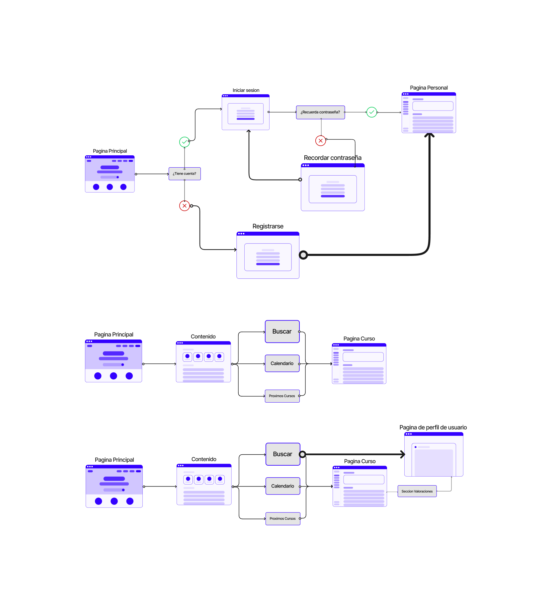
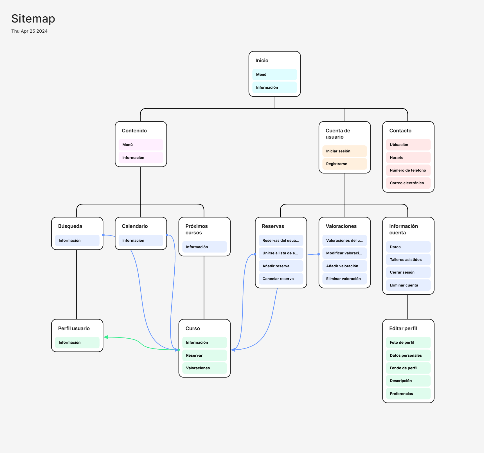
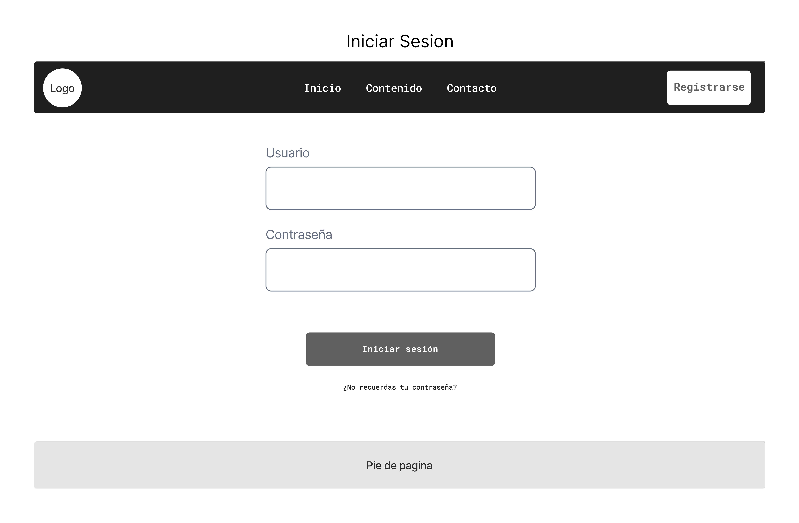

## Paso 2. UX Design  

 2.a Reframing / IDEACION: Feedback Capture Grid
----

En base a la informacion recabada en la anterior practica y haciendo caso a las experiencias de nuestros usuarios ficticios,
hemos realizado un malla receptora de informacion con la que hemos desarrollado nuevas ideas que pretendemos aplicar a nuestro diseño final
de forma que se potencie la parte social de esta.
  
 

 2.b ScopeCanvas
----
Queremos desarrollar una pagina para las reservas y gestion de nusetros cursos gastronomicos en los que la gente pueda aprender sobre cocinas de diferentes culturas 
y queremos que esta experiencia se sienta personal y compartible, para ello queremos que la gente tenga perfiles a modo de mini red social en la que puedan compartir con los 
demas multimedia y comentarios de los talleres a los que asisten y que estos perfiles sean muy personalizables de forma que cada persona pueda demostrar sus gustos a los demas.

Para ello hemos realizado una propuesta de valor denominada: SocialCooking en la que mediante una tabla recabamos nuestras intenciones para esta producto.

 2.b User Flow (task) analysis 
-----

Para identificar las tareas principales y su relevancia para los usuarios primeramente hemos desarrollado una tabla en la que se recogen todas las funciones
categorizadas en base a la importancia de estas para los usuarios registrados y los no registrados.

Hemos identificado las tareas principales: Iniciar sesion, consultar taller y consultar perfil de usuario. Tras esto hemos realizado un user flow map para las tres que indica los pasos que se han de seguir para su realizacion.

 2.c IA: Sitemap + Labelling 
----

Sitemap con la estructura de la web. Algunas funcionalidades solo se pueden acceder si se inicia sesión en la aplicación.

Conceptos propuestos en el sitemap explicados.

 2.d Wireframes
-----

Hemos realizado los bocetos o wireframes para las tres tareas mas relevantes de nuestro Task Analysis. Siendo estas: Iniciar Sesion,
Consultar perfil de usuario y Consultar curso.

En ambos las partes comunes son, la barra principal que contiene un logo, las opciones principales de la pagina a modo de enlaces y la opcion de iniciar sesion
ya que hemos visualizado el wireframe como si aun no estuvieramos logueados. En caso de estarlo, en ese espacio apareceria nuestra imagen de perfil que al pulsarla
nos dirigiria a nuestra pagina de perfil de usuario. 

- **[Iniciar Sesion](IniciarSesion.png): Consta de un campo de texto para introducir el usuario y la constraseña y un boton para ingresar. Ademas, hemos incluido
un enlace en caso de no recordar la contraseña. En este caso, hay una excepcion y es que en el boton que antes era iniciar sesion en la barra principal
ahora pone registrarse por si el usuario aun no tuviera cuenta.

- **[Consultar Perfil de Usuario](PaginaPerfil.png): Consta de una foto de perfil personalizable por el usuario ademas de su nombre de usuario, una breve descripcion personal
para que al entrar a su perfil se le pueda conocer y tras esto una parte con todos los comentarios realizados por dicho usuario sobre los talleres asistidos.
Ademas se puede apreciar que el perfil tiene una imagen personaliable de fondo.

Haciendo uso del plugin Breakpoints de figma, hemos diseñado un wireframe responsive para distintos tamaños de pantalla, el cual cambia
de formato de disposicion del contenido en funcion del tamaño.

Se trata del wireframe para la consulta de un curso en el que se muestran un video de la actividad, fotos y una breve descripcion y finaliza
con una seccion de valoraciones de este. Al ir cambiando el tamaño de pantalla se ira adaptando de forma que se vean 4 fotos, si se hace mas chico
solo una y en caso de hacerse aun mas chico se dispondran la fotos en un carrousel tras el video de forma que no ocupen espacio adicional en panmtalla.

El enlace para verlo: https://www.figma.com/file/Sc5pbdElCHTUE2OdFV6kaD/Wireframe-Pagina-Taller-Breakpoints?type=design&mode=design&t=IZ4YYCYhdcT0IDyv-1

