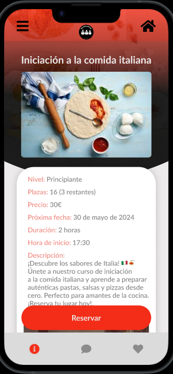

## Paso 4. Evaluación 

 4.a Caso asignado
----

Se nos ha asignado el caso del equipo DIU1_LoQueTeApetezca, el cual ha desarrollado una organización donde se crean torneos de juegos de mesa tanto para nuevos jugadores y experimentados, con el fín de acercar a mas gente al mundo de los juegos de mesa.

El enlace a su github es: https://github.com/DIU1-loqueteapetezca/DIU

 4.b User Testing
----

Con la ayuda del sistema propuesto para la creacion de personas ficticias hemos creado 4 personas las cuales dos han sido asignadas a analizar el caso A (el nuestro) y las otras 2 el caso B (el del equipo que se nos ha asignado evaluar). Las personas que hemos creado han sido:

## Persona 1: Discapacitado, le gusta la fotografía y está triste (4,5,6)

### Descripción:
- **Nombre:** Agustin Martinez
- **Edad:** 37 años
- **Situación:** Luis es un hombre en silla de ruedas que ha encontrado en la fotografía una pasión que le permite expresarse y conectar con el mundo. Últimamente ha estado triste debido a la falta de actividades inclusivas y de socialización en su entorno.

### Necesidades en la plataforma:
1. **Accesibilidad:**
   - La plataforma debe ser completamente accesible, con compatibilidad para lectores de pantalla y navegación simplificada.
2. **Opción de talleres accesibles:**
   - Información clara sobre qué talleres están adaptados para personas con discapacidad.
3. **Función social:**
   - Opciones para conectar con otros participantes antes y después de los talleres, permitiendo la formación de una comunidad.
4. **Integración de intereses:**
   - Oportunidades para incorporar su interés en la fotografía, como talleres que combinen cocina y fotografía.

## Persona 2: Persona amistosa, estudiante, con miedo (3,1,2)

### Descripción:
- **Nombre:** Ana López
- **Edad:** 22 años
- **Situación:** Ana es una estudiante universitaria sociable pero que ha desarrollado miedo a nuevas experiencias debido a una mala experiencia anterior. Busca formas de superar sus miedos y conocer gente nueva.

### Necesidades en la plataforma:
1. **Seguridad y confianza:**
   - Información detallada sobre los talleres, los instructores y las medidas de seguridad.
2. **Valoraciones y testimonios:**
   - Opiniones de otros usuarios que ayuden a reducir su miedo al participar.
3. **Interacción social:**
   - Espacios para interactuar con otros estudiantes, como foros o grupos de chat.
4. **Flexibilidad:**
   - Opciones para probar talleres gratuitos o de bajo costo antes de comprometerse con algo más grande.

## Persona 3: Trabajador, extranjero, enfadado (5,2,1)

### Descripción:
- **Nombre:** Ahmed Hassan
- **Edad:** 35 años
- **Situación:** Ahmed es un profesional que se mudó a un nuevo país por trabajo. Se siente frustrado y enfadado por las barreras culturales y la dificultad para adaptarse.

### Necesidades en la plataforma:
1. **Multilingüe:**
   - La plataforma debe estar disponible en varios idiomas, incluyendo su idioma nativo.
2. **Integración cultural:**
   - Torneos y juegos que incluyan elementos de su cultura de origen o que fomenten la integración cultural.
3. **Servicio al cliente:**
   - Soporte eficiente y amable para resolver cualquier problema técnico o duda.
4. **Función social:**
   - Eventos y torneos sociales que permitan a Ahmed conocer personas en situaciones similares y crear una red de apoyo.

## Persona 4: Padre de familia, con un horario apretado, triste (2,4,6)

### Descripción:
- **Nombre:** Carlos Fernández
- **Edad:** 45 años
- **Situación:** Carlos es un padre de familia con un trabajo demandante y poco tiempo libre. Su estrés y tristeza provienen de la falta de tiempo para disfrutar de actividades en familia.

### Necesidades en la plataforma:
1. **Flexibilidad horaria:**
   - Torneos en horarios variados y opciones para inscripciones de última hora.
2. **Actividades familiares:**
   - Torneos diseñados para que puedan participar adultos y niños juntos.
3. **Recordatorios y organización:**
   - Herramientas para gestionar su tiempo, como recordatorios automáticos y sincronización con calendarios.
4. **Función social:**
   - Opciones para conocer a otras familias con intereses similares, facilitando el desarrollo de una red de apoyo y amistad.

Por tanto la tabla propuesta con los datos de nuestros personajes queda tal que asi:

# Resultados del Test de Usuarios

| Id       | Sexo/Edad    | Ocupación       | Experiencia Internet | Plataforma | Perfil cubierto                                                                                                                                    | TEST | SUS score |
|----------|--------------|-----------------|----------------------|------------|----------------------------------------------------------------------------------------------------------------------------------------------------|------|-----------|
| Agustín  | Hombre/37    | Teleoperador    | Alta                 | Windows    | Hombre en silla de ruedas que ha encontrado en la fotografía una pasión que le permite expresarse y conectar con el mundo. Está triste porque siente que la plataforma tiene potencial pero no incluye información sobre accesibilidad. | A    | 75          |
| Ana      | Mujer/20     | Estudiante      | Alta                 | Android    | Estudiante universitaria sociable pero que ha desarrollado miedo a nuevas experiencias debido a una mala experiencia anterior. Le ha resultado una buena experiencia ya que antes de ir a un taller puede hablar con otras personas, ver contenidos y conocer las experiencias de otros usuarios. | A    | 85          |
| Ahmed    | Hombre/35    | Informático     | Alta                 | Linux      | Extranjero que trata de socializar, frustrado porque no entiende bien el idioma de la página y le está costando tener que ir traduciendo por su cuenta la información | B    | 87.5          |
| Carlos   | Hombre/45    | Dueño de un bar | Baja                 | Android    | Padre ocupado y estresado por el trabajo que busca socializar y hacer actividades con su familia. Está triste porque los torneos no se ajustan bien a sus horarios y no puede filtrar los que permiten participar adultos y niños a la vez. | B    | 72.5          |

 4.c Evaluación mediante Eye Tracking
----

Para el experimento vamos a usar Gaze Recorder, la herramienta recomendada en el guion de prácticas, para ello, vamos a analizar 3 páginas de nuestro prototipo y del de los compañeros poniendo puntos de interes relevantes en cada pagina y observando las mediciones tomadas en funcion de los usuarios que tomaran el experimento.

Los usuarios que tomaran el experimento seran 3: dos de ellos somos los que hemos desarrollado el prototipo de este repositorio de github por lo cual tendremos ciertos conocimientos sobre diseño y ademas de nuestro prototipo. El ultimo sera un usuario anonimo sin experiencia previa en este campo.

Hemos obtenido tres paginas para cada proyecto, siendo estas:

Hemos asignado puntos de interes y hemos iniciado el experimento. Asi ha ido para cada usuario:

## Daniel

## Miguel

## Usuario anonimo

Por tanto los datos recabadas por los puntos de interes han sido estos:

Observando estos datos podemos ver claramente que:

En la página de perfil de nuestro prototipo todos los usuarios han pasado por alto el botón de logout y solo Daniel ha visto la sección de comentarios. En la página del taller solo el usuario anónimo se ha fijado en el título de este y nadie en el botón de agregar favoritos. En la página principal vemos que el buscador resalta ya que todos le han prestado bastante atención, en cambio el calendario ha pasado desapercibido.

En la página de inscripción a un torneo del prototipo del caso B, los usuarios pasan por alto la opción de iniciar sesión pero sorprendentemente ven claramente el mensaje sobre el método de pago. En la página de información sobre un torneo se vuelve a pasar por alto la opción de inicio de sesión y el título solo es visto por Daniel. En la página de inicio esta vez el botón de inicio de sesión es visto por Miguel y se presta atención a la barra de navegación y a la foto de los torneos.

 4.d Cuestionario SUS
----

Ambas páginas obtienen una buena puntuación, pese a que aún se podrían mejorar. De media llegan a la misma, por lo que ninguna queda por delante de la otra.

 4.e Usability Report
----

Como conclusion del report de usabilidad basado en el resultado del cuestionario SUS para la práctica OTJM del grupo loqueteaptezca obtenemos lo siguiente: [Usability_Report](P4_UsabReport_OTJM_doneby_DIU2_ElCumpleDeMarta.pdf)

La página es simple y fácil de comprender y utilizar, permitiendo que se adapte a la mayoría de las personas. Al tratarse de un prototipo aún quedaría por ver como funcionan algunas partes pero va bien encaminado.

En general está bien, pero se podrían mejorar los siguientes aspectos:

-Hacer la interfaz algo más atractiva

-Añadir algun tipo de búsqueda para los torneos

-Permitir el filtrado de los torneos de alguna manera según lo que buscas

-Algún tipo de perfil de usuario en el que poder guardar información sobre los torneos jugados, clasificación…

-Algo de claridad sobre para que sirve registrarse en la web (si mantiene tus datos…)

5.) Conclusion de EVALUACION (A/B testing + usability report + eye tracking) 
----

- A/B Testing: Este método nos permitió comparar dos versiones del diseño para determinar cuál proporcionaba una mejor experiencia de usuario. Observamos que ambas versiones consiguen puntuaciones similares para varios tipos de usuarios y necesidades.
- Eye Tracking: Con eye tracking, pudimos identificar las áreas que capturaban más atención y aquellas que fueron ignoradas. En nuestro prototipo, descubrimos que elementos clave como botones de logout y secciones de comentarios fueron pasados por alto. Este feedback es crucial para realizar ajustes en el diseño, asegurando que todos los elementos importantes sean visibles y accesibles. Mediante los puntos de interes pudimos ver que ambos casos necesitan potenciar la visibilidad de elementos determinados.
- Usability Report: Este informe nos proporcionó una visión detallada de la experiencia del usuario, destacando puntos fuertes y áreas de mejora para el caso B. El feedback indicó la necesidad de mejorar la navegación y la presentación de información para asegurar que los usuarios puedan interactuar con la plataforma de manera eficiente, ademas de claridad y una forma de guardar la informacion relevante para el usuario cosa destacable de nuestro prototipo.

## Conclusión final / Valoración de las prácticas

El proceso de evaluación mediante técnicas como A/B testing, eye tracking y usability reports ha sido extremadamente valioso para entender cómo los usuarios interactúan con la plataforma y qué mejoras son necesarias. Hemos aprendido que la accesibilidad y la claridad en la información son fundamentales para una buena experiencia de usuario. Además, la importancia de pruebas continuas y la incorporación de feedback directo de los usuarios se ha hecho evidente. En general, este proceso ha resaltado la importancia de un enfoque centrado en el usuario en el desarrollo de plataformas digitales, lo que nos ha llevado a realizar ajustes significativos que mejorarán la satisfacción y el compromiso de los usuarios con la plataforma.
