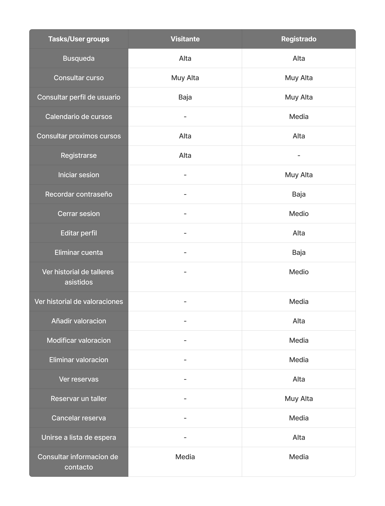

# DIU24
Prácticas Diseño Interfaces de Usuario 2023-24 (Tema: Experiencias gastronómicas ) 

Grupo: DIU2_ElCumpleDeMarta.  Curso: 2023/24 
Updated: 22/3/2024

## Proyecto: 
**SocialCooking**

## Descripción: 

Pagina para la reserva y gestion de nuestros cursos gastronomicos en los que la gente pueda aprender sobre cocinas de diferentes culturas. Queremos que esta experiencia se sienta personal y compartible, para ello los usuarios dispondran de perfiles a modo de mini red social en la que puedan compartir con los demas multimedia y comentarios de los talleres a los que asisten. Estos perfiles seran muy personalizables de forma que cada persona pueda demostrar sus gustos a los demas. De esta forma se pretende crear una comunidad de amantas de la cocina que esten dispuestos a aprender y conocer gente nueva basada en sus gustos.

## Logotipo: 

## Miembros
 * :bust_in_silhouette:   Daniel Fernández Jiménez     :octocat:     
 * :bust_in_silhouette:  Miguel Montiel Carrasco     :octocat:

----- 

# Proceso de Diseño 

## UX User & Desk Research & Analisis 

 **1.a User Reseach Plan**
-----

El plan de este proyecto es recopilar información sobre cómo los usuarios organizan sus experiencias gastronómicas con el propósito de sacar una base de ideas e información para,
 en una etapa siguiente poder aplicar este conocimiento recopilado en el desarrollo de nuestro propio producto. Todo esto siguiendo diferentes tipos de metodos de estudio. Dicho plan
 queda explicado en [User Research Plan](P1/User_Research_Plan.pdf).

 1.b Competitive Analysis
-----

Como ejemplos para el analisis de la competencia hemos elegido 3 paginas diferentes de experiencias gastronicas en granada, las dos que se proponen en el guion de la practica: 
PilsaEduca y Granada Cooking Expirience, junto a una que hemos investigado por nuestra cuenta denominada Aptitu que tambien ofrece talleres y es de Granada.

Hemos realizado un analisis de la competencia mediante una breve [Competitor Analysis](P1/Competitor_Analysis.pdf) en la que comentamos sobre aspectos de distintas areas de interes con las que cuentan o no cuentan estas 
opciones y de tenerlas como de buenas son estas. Ademas de la explicacion se añade un aporte visual en el que se califica si es buena, regular o mala en dicho aspecto. 

Para el analisis que se va a realizar posteriormente hemos decidido elegir a Granada Cooking Experience como la propuesta a nalizar debido a que es en la que mas inconsistencias 
hemos encontrado y pensamos que es un buen caso de estudio para sacar conclusiones sobre lo que no se deberia hacer.

 1.c Persona
-----

Se han creado 2 personas ficticias para ser usadas a la hora de analizar la experiencia de un posible usuario interesado en la pagina elegida.

- **[Marta Sanchez](P1/Marta_Sanchez.png) (Creada por Miguel Montiel Carrasco)**: una señora mayor que a su alta edad se ve sola y con mucho tiempo tras la muerte de su marido y busca experiencias que le permitan entretenerse y tener compañia.

- **[Eric Bouba](P1/Eric_Bouba.png) (Creado por Daniel Fernández Jiménez)**: patinador profesional que fue fichado por su entrenador y ahora vive en Granada para poder entrenar y proseguir su carrera como patinador dejando el calor de su familia en Camerun, su tierra natal. Debido al estres que le produce su situacion busca una experiencia que le permita olvidarse de sus preocupaciones por un momento.

 1.d User Journey Map
----

- **[Journey Map Marta Sanchez](P1/Marta_Journey.png)**: Marta quiere aprender nuevas recetas ya que siempre le ha gustado mucho cocinar y ademas busca una forma de conocer gente. Su hijo le muestra Granada Cooking Experience e intenta buscar y apuntarse a uno de los que le gusten pero debido a su avanzada edad, no es muy diestra con la tecnologia y ademas encuentra la pagina poco intuitiva y con muchas opciones por lo que se abruma y decide perdile ayuda a sus hijos. Sus hijos la registran mientras que ella intenta recordar el proceso pero le cuesta porque lo nota muy complejo. Esto causa que la proxima ocasion suceda lo mismo.

- **[Journey Map Eric Bouba](P1/Eric_Journey.png)**: El proposito de eric es el de apuntarse a uno de los talleres de cocina de Granada Cooking Experience que le ha propuesto su entrenador. La experiencia comienza bien ya que viniendo de un comentario positivo de su entrenador sobre la pagina le apetece mucho intentar probar esta nueva experiencia. Sin embargo, al intentar reservar por despiste y debido a su bajo nivel de entendimiento tecnologico, se le dificulta de primeras encontar la informacionm sobre el taller como puede ser la fecha que es la razon de su siguiente problema, ya que, al momento de intentar reservar mediante la funcion de calendario de la pagina es incapaz de ver fechas disponibles para dicho taller ya que el calendario comienza en el mes en el que se esta y no en el que transcurre el taller. Al no entenderlo y no ver ninguna forma de hacer la reserva se frustra y decide abandonar la idea.

 1.e Usability Review & Briefing
----

- **Enlace al documento**:  [Usability Review](P1/Usability-review.pdf) 
- **Valoración final (numérica)**: 88

**Briefing**: hemos decidido analizar el caso de Granada Cooking Experience. Al momento de la valoracion hemos visto que dicha pagina tiene cualidades que en su mayoria estan muy bien y valoramos que esten pulidas y no generen problema. Sin embargo, tambien hemos encontrado cualidades que deberian cumplirse siempre como pueden ser los problemas a la hora de añadir o visualizar la cesta, opciones de busqueda que nos permitan encontrar lo que buscamos o el feedback general de la pagina.

## Paso 2. UX Design  

 2.a Reframing / IDEACION: Feedback Capture Grid / EMpathy map 
----
En base a la informacion recabada en la anterior practica y haciendo caso a las experiencias de nuestros usuarios ficticios,
hemos realizado un malla receptora de informacion con la que hemos desarrollado nuevas ideas que pretendemos aplicar a nuestro diseño final
de forma que se potencie la parte social de esta.

 

 2.b ScopeCanvas
----
Queremos desarrollar una pagina para las reservas y gestion de nusetros cursos gastronomicos en los que la gente pueda aprender sobre cocinas de diferentes culturas 
y queremos que esta experiencia se sienta personal y compartible, para ello queremos que la gente tenga perfiles a modo de mini red social en la que puedan compartir con los 
demas multimedia y comentarios de los talleres a los que asisten y que estos perfiles sean muy personalizables de forma que cada persona pueda demostrar sus gustos a los demas.

Para ello hemos realizado una propuesta de valor denominada: SocialCooking en la que mediante una tabla recabamos nuestras intenciones para esta producto.

 2.b User Flow (task) analysis 
-----

Para identificar las tareas principales y su relevancia para los usuarios primeramente hemos desarrollado una tabla en la que se recogen todas las funciones
categorizadas en base a la importancia de estas para los usuarios registrados y los no registrados.

Hemos identificado las tareas principales: Iniciar sesion, consultar taller y consultar perfil de usuario. Tras esto hemos realizado un user flow map para las tres que indica los pasos que se han de seguir para su realizacion.

 2.c IA: Sitemap + Labelling 
----

Sitemap con la estructura de la web. Algunas funcionalidades solo se pueden acceder si se inicia sesión en la aplicación.

Conceptos propuestos en el sitemap explicados.

 2.d Wireframes
-----
Hemos realizado los bocetos o wireframes para las tres tareas mas relevantes de nuestro Task Analysis. Siendo estas: Iniciar Sesion,
Consultar perfil de usuario y Consultar curso.

En ambos las partes comunes son, la barra principal que contiene un logo, las opciones principales de la pagina a modo de enlaces y la opcion de iniciar sesion
ya que hemos visualizado el wireframe como si aun no estuvieramos logueados. En caso de estarlo, en ese espacio apareceria nuestra imagen de perfil que al pulsarla
nos dirigiria a nuestra pagina de perfil de usuario. 

- [Iniciar Sesion](P2/IniciarSesion.png): Consta de un campo de texto para introducir el usuario y la constraseña y un boton para ingresar. Ademas, hemos incluido
un enlace en caso de no recordar la contraseña. En este caso, hay una excepcion y es que en el boton que antes era iniciar sesion en la barra principal
ahora pone registrarse por si el usuario aun no tuviera cuenta.

- [Consultar Perfil de Usuario](P2/PaginaPerfil.png): Consta de una foto de perfil personalizable por el usuario ademas de su nombre de usuario, una breve descripcion personal
para que al entrar a su perfil se le pueda conocer y tras esto una parte con todos los comentarios realizados por dicho usuario sobre los talleres asistidos.
Ademas se puede apreciar que el perfil tiene una imagen personaliable de fondo.

Haciendo uso del plugin Breakpoints de figma, hemos diseñado un wireframe responsive para distintos tamaños de pantalla, el cual cambia
de formato de disposicion del contenido en funcion del tamaño.

Se trata del wireframe para la consulta de un curso en el que se muestran un video de la actividad, fotos y una breve descripcion y finaliza
con una seccion de valoraciones de este. Al ir cambiando el tamaño de pantalla se ira adaptando de forma que se vean 4 fotos, si se hace mas chico
solo una y en caso de hacerse aun mas chico se dispondran la fotos en un carrousel tras el video de forma que no ocupen espacio adicional en panmtalla.

El enlace para verlo: https://www.figma.com/file/Sc5pbdElCHTUE2OdFV6kaD/Wireframe-Pagina-Taller-Breakpoints?type=design&mode=design&t=IZ4YYCYhdcT0IDyv-1

## Paso 3. Mi UX-Case Study (diseño)

 3.a Moodboard
-----
Se ha dividido por partes el moodboard para que sea mas claro y conciso a la hora de buscar los elemnetos requeridos para el diseño. Los puntos mas importante a la hora del desarrollo del diseño han sido:

- Logotipo: Se ha diseñado con la ayuda de herramientas de IA y Photoshop, llegando a un diseño minimalista y moderno, utilizando tonos rojos para destacar la pasión por la cocina. Incluye iconos de utensilios de cocina y una disposición que evoca la idea de comunidad y compartir. Ademas incluye dos versionesa color y en blanco y negro para una mayor versatilidad a la hora de usarlos.

- Paleta de Colores: Los colores principales son el rojo y el rosa, que representan la energía y la interacción social. El blanco, negro y gris se utilizan como colores neutros para equilibrar el diseño y aportar claridad y elegancia. De esta forma se logra transmitir calidez, pasión y profesionalismo, reforzando la temática culinaria de la plataforma.

- Tipografía: Las fuente seleccionada "Lato" es moderna y legible. Ademas se especifica el tamaño que se debe usar para cada zona.

- Imágenes Inspiracionales: Las imágenes elegidas muestran situaciones de cocina, platos atractivos y momentos de interacción social, reforzando la temática gastronómica y el sentido de comunidad que SocialCooking promueve ademas de servir de inspiracion para el desarrollo del estilo del producto.

- Iconografía: Los iconos son simples y fácilmente reconocibles, utilizando el color rojo para mantener la coherencia visual. Representan diversas funciones de la aplicación, como navegación, perfil de usuario, y compartir contenido.

  3.b Landing Page
----
La landing page de SocialCooking está diseñada para captar la atención de los usuarios y resaltar las principales características y beneficios de la plataforma ofreciendo gran variedad de informacion y recursos para que el usuario pueda informarse como es debido del produco. Tambien, se aprovecha para incidir en el usuario la posibilidad de unirse facilmente a la comunidad a traves de la descarga de la aplicacion.

 3.c Guidelines
----
Para el diseño del prototipo se implementarán patrones de diseño siguiendo las guidelines de Google Material Design. Se han aplicado de la siguiente forma:

- **Onboarding**: En las primeras dos pantallas, se mostrará el logotipo de la aplicación y una bienvenida con opciones de "Iniciar sesión" y "Registrarse". Esto ayuda a los usuarios a orientarse y entender el propósito de la aplicación desde el principio.

- **Menu (navBar adaptada a móvil)**: En todo momento una vez iniciada la sesión se mostrará una barra de navegación en la parte inferior con iconos que representan diferentes secciones de la aplicación: inicio, búsqueda y perfil. Esto facilita la navegación en dispositivos móviles.

- **Hero image + Carousel**: La pantalla de cada taller muestra una imagen destacada (Hero image) que captura la atención del usuario donde se implementará un carrousel con el resto de las fotos de la galería de dicho taller.

- **Search**: En la página principal habrá un campo de búsqueda que permite a los usuarios buscar talleres específicos que desean aprender. Esto mejora la experiencia del usuario al facilitar el acceso a la información deseada.

- **Article List (5-7 Cards items)**: La misma pantalla principal también mostrará una lista de talleres disponibles en formato de tarjetas, donde cada tarjeta incluye una imagen, nivel, plazas disponibles y precio. Esto organiza la información de manera clara y atractiva.

- **Item details + actions**: Al seleccionar un taller, se mostrará una pantalla con los detalles del mismo, incluyendo el nombre del taller, nivel, plazas restantes, precio, fecha, duración y descripción. También tendrá un botón de "Reservar" para que los usuarios puedan inscribirse directamente.

- **Reserva**: En la pantalla de detalle del taller, el botón de "Reservar" permite a los usuarios inscribirse en el taller.

- **Form Input**: Las pantallas de inicio de sesión y registro mostraran formularios donde los usuarios pueden ingresar su información, como correo electrónico, nombre de usuario y contraseña.

- **About**: La pantalla de perfil del usuario incluirá una breve biografía y detalles personales.

  3.d Mockup
----
Suigiendo todo lo explicado previamente, se ha desarrollado finalmente un prototipo de la aplicacion con las partes mas importantes y necesarias de esta que sirven de ejemplo para hechar un pequeño vistazo a lo que esta comunidad gastronomica quiere ofrecer a sus usuarios.

Ademas se ha diseñado de forma interactiva y puede ser probada [aquí](https://www.figma.com/proto/aRtI9ezTnWwBnwNhYpuuUx/MockUp?node-id=3-52&t=ZCuXN5TDsYLTzZ7y-1&scaling=scale-down&page-id=0%3A1&starting-point-node-id=3%3A52)

Añadimos un [video](/P3/videoApp.mp4) probando las funcinalidades clave del prototipo.

 3.e ¿My UX-Case Study?
-----
### Origen y Motivación

SocialCooking es una plataforma innovadora diseñada para enriquecer el conocimiento gastronómico y fomentar la interacción social entre los amantes de la cocina. La inspiración surgió al observar que hay personas con necesidades y objetivos culinarios muy variados como Marta, una señora mayor que busca entretenimiento y compañía tras la pérdida de su esposo, y Eric, un patinador profesional de Camerún que vive en Granada y necesita una manera de aliviar el estrés y conectar con otros a través de la cocina.

### Proceso Creativo y Desarrollo

**Investigación y Conceptualización**

Motivados por las historias de Marta y Eric, identificamos la necesidad de una plataforma que no solo permitiera inscribirse en talleres de cocina, sino que también funcionara como una red social culinaria. Utilizando herramientas como el Scope Canvas, reunimos ideas y objetivos para definir las características clave de la aplicación.

**Diseño Conceptual**

Iniciamos el proceso con la creación de bocetos y un wireframe básico para establecer la estructura y navegación de SocialCooking. Estos primeros diseños nos ayudaron a visualizar cómo los usuarios interactuarían con la plataforma y a identificar los elementos esenciales para una experiencia fluida y atractiva.

**Definición de la Identidad Visual**

El siguiente paso fue desarrollar un moodboard que capturara la esencia de SocialCooking. Seleccionamos imágenes de platos deliciosos, colores vibrantes como el rojo y el rosa, junto con tonos neutros como el blanco, negro y gris, para crear un ambiente cálido y acogedor, y diseñamos un logotipo que evocara el placer de compartir la cocina con los demas. La fuente elegida combina legibilidad y modernidad, reforzando la identidad visual de la aplicación.

### Implementación y Diseño Final

**Landing Page**

Diseñamos una landing page que destacara las principales ventajas de SocialCooking. Esta landing page es visualmente atractiva y fácil de navegar, enfocándose en la simplicidad y en resaltar los beneficios de unirse a nuestra comunidad culinaria. Los visitantes pueden encontrar información clara sobre la intencionalidad de la aplicacion, los talleres que se ofrecen y donde y como descargarla y registrarse en ella, ademas de opciones en las que poder informarse mas a fondo, contactar o pedir ayuda.

**Prototipo Interactivo**

Con los diseños iniciales, creamos un prototipo interactivo utilizando Figma. Este prototipo permite a los usuarios explorar la aplicación de manera virtual, mostrando cómo pueden navegar, inscribirse en talleres y compartir sus experiencias culinarias con otros miembros de la comunidad.

El prototipo interactivo se puede ver [aquí](https://www.figma.com/proto/aRtI9ezTnWwBnwNhYpuuUx/MockUp?node-id=3-52&t=ZCuXN5TDsYLTzZ7y-1&scaling=scale-down&page-id=0%3A1&starting-point-node-id=3%3A52).

Añadimos un [video](/P3/videoApp.mp4) probando las funcinalidades clave del prototipo.

### Reflexiones y Resultados

SocialCooking es el resultado de combinar nuestras experiencias con las necesidades de personas como Marta y Eric. La aplicación ofrece una manera accesible y atractiva de aprender nuevas habilidades culinarias y de conectar con otros apasionados por la cocina. A través de un diseño cuidadoso y una identidad visual coherente, hemos creado una plataforma fácil de usar y visualmente atractiva.

SocialCooking no solo facilita el aprendizaje gastronómico, sino que también fortalece la comunidad entre sus usuarios, proporcionando una experiencia culinaria y social enriquecedora.

## Paso 4. Evaluación 

 4.a Caso asignado
----

Se nos ha asignado el caso del equipo DIU1_LoQueTeApetezca, el cual ha desarrollado una organización donde se crean torneos de juegos de mesa tanto para nuevos jugadores y experimentados, con el fín de acercar a mas gente al mundo de los juegos de mesa.

El enlace a su github es: https://github.com/DIU1-loqueteapetezca/DIU

 4.b User Testing
----

Con la ayuda del sistema propuesto para la creacion de personas ficticias hemos creado 4 personas las cuales dos han sido asignadas a analizar el caso A (el nuestro) y las otras 2 el caso B (el del equipo que se nos ha asignado evaluar). Las personas que hemos creado han sido:

## Persona 1: Discapacitado, le gusta la fotografía y está triste (4,5,6)

### Descripción:
- **Nombre:** Agustin Martinez
- **Edad:** 37 años
- **Situación:** Luis es un hombre en silla de ruedas que ha encontrado en la fotografía una pasión que le permite expresarse y conectar con el mundo. Últimamente ha estado triste debido a la falta de actividades inclusivas y de socialización en su entorno.

### Necesidades en la plataforma:
1. **Accesibilidad:**
   - La plataforma debe ser completamente accesible, con compatibilidad para lectores de pantalla y navegación simplificada.
2. **Opción de talleres accesibles:**
   - Información clara sobre qué talleres están adaptados para personas con discapacidad.
3. **Función social:**
   - Opciones para conectar con otros participantes antes y después de los talleres, permitiendo la formación de una comunidad.
4. **Integración de intereses:**
   - Oportunidades para incorporar su interés en la fotografía, como talleres que combinen cocina y fotografía.

## Persona 2: Persona amistosa, estudiante, con miedo (3,1,2)

### Descripción:
- **Nombre:** Ana López
- **Edad:** 22 años
- **Situación:** Ana es una estudiante universitaria sociable pero que ha desarrollado miedo a nuevas experiencias debido a una mala experiencia anterior. Busca formas de superar sus miedos y conocer gente nueva.

### Necesidades en la plataforma:
1. **Seguridad y confianza:**
   - Información detallada sobre los talleres, los instructores y las medidas de seguridad.
2. **Valoraciones y testimonios:**
   - Opiniones de otros usuarios que ayuden a reducir su miedo al participar.
3. **Interacción social:**
   - Espacios para interactuar con otros estudiantes, como foros o grupos de chat.
4. **Flexibilidad:**
   - Opciones para probar talleres gratuitos o de bajo costo antes de comprometerse con algo más grande.

## Persona 3: Trabajador, extranjero, enfadado (5,2,1)

### Descripción:
- **Nombre:** Ahmed Hassan
- **Edad:** 35 años
- **Situación:** Ahmed es un profesional que se mudó a un nuevo país por trabajo. Se siente frustrado y enfadado por las barreras culturales y la dificultad para adaptarse.

### Necesidades en la plataforma:
1. **Multilingüe:**
   - La plataforma debe estar disponible en varios idiomas, incluyendo su idioma nativo.
2. **Integración cultural:**
   - Torneos y juegos que incluyan elementos de su cultura de origen o que fomenten la integración cultural.
3. **Servicio al cliente:**
   - Soporte eficiente y amable para resolver cualquier problema técnico o duda.
4. **Función social:**
   - Eventos y torneos sociales que permitan a Ahmed conocer personas en situaciones similares y crear una red de apoyo.

## Persona 4: Padre de familia, con un horario apretado, triste (2,4,6)

### Descripción:
- **Nombre:** Carlos Fernández
- **Edad:** 45 años
- **Situación:** Carlos es un padre de familia con un trabajo demandante y poco tiempo libre. Su estrés y tristeza provienen de la falta de tiempo para disfrutar de actividades en familia.

### Necesidades en la plataforma:
1. **Flexibilidad horaria:**
   - Torneos en horarios variados y opciones para inscripciones de última hora.
2. **Actividades familiares:**
   - Torneos diseñados para que puedan participar adultos y niños juntos.
3. **Recordatorios y organización:**
   - Herramientas para gestionar su tiempo, como recordatorios automáticos y sincronización con calendarios.
4. **Función social:**
   - Opciones para conocer a otras familias con intereses similares, facilitando el desarrollo de una red de apoyo y amistad.

Por tanto la tabla propuesta con los datos de nuestros personajes queda tal que asi:

# Resultados del Test de Usuarios

| Id       | Sexo/Edad    | Ocupación       | Experiencia Internet | Plataforma | Perfil cubierto                                                                                                                                    | TEST | SUS score |
|----------|--------------|-----------------|----------------------|------------|----------------------------------------------------------------------------------------------------------------------------------------------------|------|-----------|
| Agustín  | Hombre/37    | Teleoperador    | Alta                 | Windows    | Hombre en silla de ruedas que ha encontrado en la fotografía una pasión que le permite expresarse y conectar con el mundo. Está triste porque siente que la plataforma tiene potencial pero no incluye información sobre accesibilidad. | A    | 75          |
| Ana      | Mujer/20     | Estudiante      | Alta                 | Android    | Estudiante universitaria sociable pero que ha desarrollado miedo a nuevas experiencias debido a una mala experiencia anterior. Le ha resultado una buena experiencia ya que antes de ir a un taller puede hablar con otras personas, ver contenidos y conocer las experiencias de otros usuarios. | A    | 85          |
| Ahmed    | Hombre/35    | Informático     | Alta                 | Linux      | Extranjero que trata de socializar, frustrado porque no entiende bien el idioma de la página y le está costando tener que ir traduciendo por su cuenta la información | B    | 87.5          |
| Carlos   | Hombre/45    | Dueño de un bar | Baja                 | Android    | Padre ocupado y estresado por el trabajo que busca socializar y hacer actividades con su familia. Está triste porque los torneos no se ajustan bien a sus horarios y no puede filtrar los que permiten participar adultos y niños a la vez. | B    | 72.5          |

 4.c Evaluación mediante Eye Tracking

Para el experimento vamos a usar Gaze Recorder, la herramienta recomendada en el guion de prácticas, para ello, vamos a analizar 3 páginas de nuestro prototipo y del de los compañeros poniendo puntos de interes relevantes en cada pagina y observando las mediciones tomadas en funcion de los usuarios que tomaran el experimento.

Los usuarios que tomaran el experimento seran 3: dos de ellos somos los que hemos desarrollado el prototipo de este repositorio de github por lo cual tendremos ciertos conocimientos sobre diseño y ademas de nuestro prototipo. El ultimo sera un usuario anonimo sin experiencia previa en este campo.

Hemos obtenido tres paginas para cada proyecto, siendo estas:

Hemos asignado puntos de interes y hemos iniciado el experimento. Asi ha ido para cada usuario:

## Daniel

## Miguel

## Usuario anonimo

Por tanto los datos recabadas por los puntos de interes han sido estos:

Observando estos datos podemos ver claramente que:

En la página de perfil de nuestro prototipo todos los usuarios han pasado por alto el botón de logout y solo Daniel ha visto la sección de comentarios. En la página del taller solo el usuario anónimo se ha fijado en el título de este y nadie en el botón de agregar favoritos. En la página principal vemos que el buscador resalta ya que todos le han prestado bastante atención, en cambio el calendario ha pasado desapercibido.

En la página de inscripción a un torneo del prototipo del caso B, los usuarios pasan por alto la opción de iniciar sesión pero sorprendentemente ven claramente el mensaje sobre el método de pago. En la página de información sobre un torneo se vuelve a pasar por alto la opción de inicio de sesión y el título solo es visto por Daniel. En la página de inicio esta vez el botón de inicio de sesión es visto por Miguel y se presta atención a la barra de navegación y a la foto de los torneos.

 4.d Cuestionario SUS
----

Ambas páginas obtienen una buena puntuación, pese a que aún se podrían mejorar. De media llegan a la misma, por lo que ninguna queda por delante de la otra.

 4.e Usability Report
----

Como conclusion del report de usabilidad basado en el resultado del cuestionario SUS para la práctica OTJM del grupo loqueteaptezca obtenemos lo siguiente: [Usability_Report](/P4/P4_UsabReport_OTJM_doneby_DIU2_ElCumpleDeMarta.pdf)

La página es simple y fácil de comprender y utilizar, permitiendo que se adapte a la mayoría de las personas. Al tratarse de un prototipo aún quedaría por ver como funcionan algunas partes pero va bien encaminado.

En general está bien, pero se podrían mejorar los siguientes aspectos:

-Hacer la interfaz algo más atractiva

-Añadir algun tipo de búsqueda para los torneos

-Permitir el filtrado de los torneos de alguna manera según lo que buscas

-Algún tipo de perfil de usuario en el que poder guardar información sobre los torneos jugados, clasificación…

-Algo de claridad sobre para que sirve registrarse en la web (si mantiene tus datos…)

5.) Conclusion de EVALUACION (A/B testing + usability report + eye tracking) 
----

-  A/B Testing: Este método nos permitió comparar dos versiones del diseño para determinar cuál proporcionaba una mejor experiencia de usuario. Observamos que ambas versiones consiguen puntuaciones similares para varios tipos de usuarios y necesidades.
- Eye Tracking: Con eye tracking, pudimos identificar las áreas que capturaban más atención y aquellas que fueron ignoradas. En nuestro prototipo, descubrimos que elementos clave como botones de logout y secciones de comentarios fueron pasados por alto. Este feedback es crucial para realizar ajustes en el diseño, asegurando que todos los elementos importantes sean visibles y accesibles. Mediante los puntos de interes pudimos ver que ambos casos necesitan potenciar la visibilidad de elementos determinados.
- Usability Report: Este informe nos proporcionó una visión detallada de la experiencia del usuario, destacando puntos fuertes y áreas de mejora para el caso B. El feedback indicó la necesidad de mejorar la navegación y la presentación de información para asegurar que los usuarios puedan interactuar con la plataforma de manera eficiente, ademas de claridad y una forma de guardar la informacion relevante para el usuario cosa destacable de nuestro prototipo.

## Conclusión final / Valoración de las prácticas

El proceso de evaluación mediante técnicas como A/B testing, eye tracking y usability reports ha sido extremadamente valioso para entender cómo los usuarios interactúan con la plataforma y qué mejoras son necesarias. Hemos aprendido que la accesibilidad y la claridad en la información son fundamentales para una buena experiencia de usuario. Además, la importancia de pruebas continuas y la incorporación de feedback directo de los usuarios se ha hecho evidente. En general, este proceso ha resaltado la importancia de un enfoque centrado en el usuario en el desarrollo de plataformas digitales, lo que nos ha llevado a realizar ajustes significativos que mejorarán la satisfacción y el compromiso de los usuarios con la plataforma.
