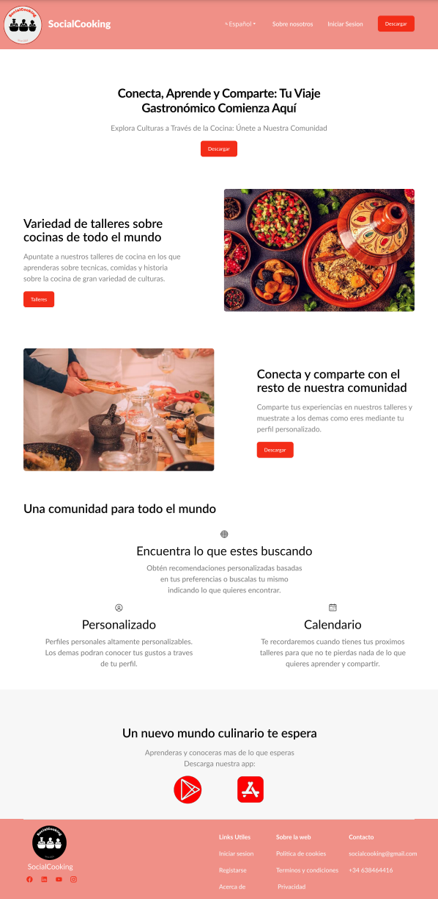
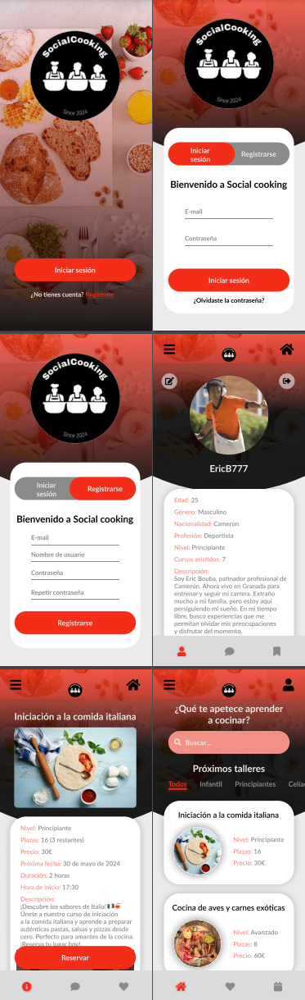

# DIU24
Prácticas Diseño Interfaces de Usuario 2023-24 (Tema: Experiencias gastronómicas ) 

Grupo: DIU2_ElCumpleDeMarta.  Curso: 2023/24 
Updated: 22/3/2024

Proyecto: 
>>> Decida el nombre corto de su propuesta en la práctica 2 

Descripción: 

>>> Describa la idea de su producto en la práctica 2 

Logotipo: 
>>> Opcionalmente si diseña un logotipo para su producto en la práctica 3 pongalo aqui

Miembros
 * :bust_in_silhouette:   Daniel Fernández Jiménez     :octocat:     
 * :bust_in_silhouette:  Miguel Montiel Carrasco     :octocat:

----- 

# Proceso de Diseño 

## UX User & Desk Research & Analisis 

 **1.a User Reseach Plan**
-----

El plan de este proyecto es recopilar información sobre cómo los usuarios organizan sus experiencias gastronómicas con el propósito de sacar una base de ideas e información para,
 en una etapa siguiente poder aplicar este conocimiento recopilado en el desarrollo de nuestro propio producto. Todo esto siguiendo diferentes tipos de metodos de estudio. Dicho plan
 queda explicado en [User Research Plan](P1/User_Research_Plan.pdf).

 1.b Competitive Analysis
-----

Como ejemplos para el analisis de la competencia hemos elegido 3 paginas diferentes de experiencias gastronicas en granada, las dos que se proponen en el guion de la practica: 
PilsaEduca y Granada Cooking Expirience, junto a una que hemos investigado por nuestra cuenta denominada Aptitu que tambien ofrece talleres y es de Granada.

Hemos realizado un analisis de la competencia mediante una breve [Competitor Analysis](P1/Competitor_Analysis.pdf) en la que comentamos sobre aspectos de distintas areas de interes con las que cuentan o no cuentan estas 
opciones y de tenerlas como de buenas son estas. Ademas de la explicacion se añade un aporte visual en el que se califica si es buena, regular o mala en dicho aspecto. 

Para el analisis que se va a realizar posteriormente hemos decidido elegir a Granada Cooking Experience como la propuesta a nalizar debido a que es en la que mas inconsistencias 
hemos encontrado y pensamos que es un buen caso de estudio para sacar conclusiones sobre lo que no se deberia hacer.

 1.c Persona
-----

Se han creado 2 personas ficticias para ser usadas a la hora de analizar la experiencia de un posible usuario interesado en la pagina elegida.

- **[Marta Sanchez](P1/Marta_Sanchez.png) (Creada por Miguel Montiel Carrasco)**: una señora mayor que a su alta edad se ve sola y con mucho tiempo tras la muerte de su marido y busca experiencias que le permitan entretenerse y tener compañia.

- **[Eric Bouba](P1/Eric_Bouba.png) (Creado por Daniel Fernández Jiménez)**: patinador profesional que fue fichado por su entrenador y ahora vive en Granada para poder entrenar y proseguir su carrera como patinador dejando el calor de su familia en Camerun, su tierra natal. Debido al estres que le produce su situacion busca una experiencia que le permita olvidarse de sus preocupaciones por un momento.

 1.d User Journey Map
----

- **[Journey Map Marta Sanchez](P1/Marta_Journey.png)**: Marta quiere aprender nuevas recetas ya que siempre le ha gustado mucho cocinar y ademas busca una forma de conocer gente. Su hijo le muestra Granada Cooking Experience e intenta buscar y apuntarse a uno de los que le gusten pero debido a su avanzada edad, no es muy diestra con la tecnologia y ademas encuentra la pagina poco intuitiva y con muchas opciones por lo que se abruma y decide perdile ayuda a sus hijos. Sus hijos la registran mientras que ella intenta recordar el proceso pero le cuesta porque lo nota muy complejo. Esto causa que la proxima ocasion suceda lo mismo.

- **[Journey Map Eric Bouba](P1/Eric_Journey.png)**: El proposito de eric es el de apuntarse a uno de los talleres de cocina de Granada Cooking Experience que le ha propuesto su entrenador. La experiencia comienza bien ya que viniendo de un comentario positivo de su entrenador sobre la pagina le apetece mucho intentar probar esta nueva experiencia. Sin embargo, al intentar reservar por despiste y debido a su bajo nivel de entendimiento tecnologico, se le dificulta de primeras encontar la informacionm sobre el taller como puede ser la fecha que es la razon de su siguiente problema, ya que, al momento de intentar reservar mediante la funcion de calendario de la pagina es incapaz de ver fechas disponibles para dicho taller ya que el calendario comienza en el mes en el que se esta y no en el que transcurre el taller. Al no entenderlo y no ver ninguna forma de hacer la reserva se frustra y decide abandonar la idea.

 1.e Usability Review & Briefing
----

- **Enlace al documento**:  [Usability Review](P1/Usability-review.pdf) 
- **Valoración final (numérica)**: 88

**Briefing**: hemos decidido analizar el caso de Granada Cooking Experience. Al momento de la valoracion hemos visto que dicha pagina tiene cualidades que en su mayoria estan muy bien y valoramos que esten pulidas y no generen problema. Sin embargo, tambien hemos encontrado cualidades que deberian cumplirse siempre como pueden ser los problemas a la hora de añadir o visualizar la cesta, opciones de busqueda que nos permitan encontrar lo que buscamos o el feedback general de la pagina.

## Paso 2. UX Design  

 2.a Reframing / IDEACION: Feedback Capture Grid / EMpathy map 
----

>>> Comenta con un diagrama los aspectos más destacados a modo de conclusion de la práctica anterior,

 Interesante | Críticas     
| ------------- | -------
  Preguntas | Nuevas ideas
  
    
>>> ¿Que planteas como "propuesta de valor" para un nuevo diseño de aplicación para economia colaborativa ?
>>> Problema e hipótesis
>>>  Que planteas como "propuesta de valor" para un nuevo diseño de aplicación para economia colaborativa te
>>> (150-200 caracteres)

 2.b ScopeCanvas
----
>>> Propuesta de valor 

 2.b User Flow (task) analysis 
-----

>>> Definir "User Map" y "Task Flow" ... 

 2.c IA: Sitemap + Labelling 
----

>>> Identificar términos para diálogo con usuario  

Término | Significado     
| ------------- | -------
  Login¿?  | acceder a plataforma

 2.d Wireframes
-----

>>> Plantear el  diseño del layout para Web/movil (organización y simulación ) 

## Paso 3. Mi UX-Case Study (diseño)

 3.a Moodboard
-----

>>> Plantear Diseño visual con una guía de estilos visual (moodboard) 
>>> Incluir Logotipo
>>> Si diseña un logotipo, explique la herramienta utilizada y la resolución empleada. ¿Puede usar esta imagen como cabecera de Twitter, por ejemplo, o necesita otra?

  3.b Landing Page
----

>>> Plantear Landing Page 

 3.c Guidelines
----

>>> Estudio de Guidelines y Patrones IU a usar 
>>> Tras documentarse, muestre las deciones tomadas sobre Patrones IU a usar para la fase siguiente de prototipado. 

  3.d Mockup
----

>>> Layout: Mockup / prototipo HTML  (que permita simular tareas con estilo de IU seleccionado)

 3.e ¿My UX-Case Study?
-----
### Origen y Motivación

SocialCooking es una plataforma innovadora diseñada para enriquecer el conocimiento gastronómico y fomentar la interacción social entre los amantes de la cocina. La inspiración surgió al observar que hay personas con necesidades y objetivos culinarios muy variados como Marta, una señora mayor que busca entretenimiento y compañía tras la pérdida de su esposo, y Eric, un patinador profesional de Camerún que vive en Granada y necesita una manera de aliviar el estrés y conectar con otros a través de la cocina.

### Proceso Creativo y Desarrollo

**Investigación y Conceptualización**

Motivados por las historias de Marta y Eric, identificamos la necesidad de una plataforma que no solo permitiera inscribirse en talleres de cocina, sino que también funcionara como una red social culinaria. Utilizando herramientas como el Scope Canvas, reunimos ideas y objetivos para definir las características clave de la aplicación.

**Diseño Conceptual**

Iniciamos el proceso con la creación de bocetos y un wireframe básico para establecer la estructura y navegación de SocialCooking. Estos primeros diseños nos ayudaron a visualizar cómo los usuarios interactuarían con la plataforma y a identificar los elementos esenciales para una experiencia fluida y atractiva.

**Definición de la Identidad Visual**

El siguiente paso fue desarrollar un moodboard que capturara la esencia de SocialCooking. Seleccionamos imágenes de platos deliciosos, colores vibrantes como el rojo y el rosa, junto con tonos neutros como el blanco, negro y gris, para crear un ambiente cálido y acogedor, y diseñamos un logotipo que evocara el placer de compartir la cocina con los demas. La fuente elegida combina legibilidad y modernidad, reforzando la identidad visual de la aplicación.

### Implementación y Diseño Final

**Landing Page**

Diseñamos una landing page que destacara las principales ventajas de SocialCooking. Esta landing page es visualmente atractiva y fácil de navegar, enfocándose en la simplicidad y en resaltar los beneficios de unirse a nuestra comunidad culinaria. Los visitantes pueden encontrar información clara sobre la intencionalidad de la aplicacion, los talleres que se ofrecen y donde y como descargarla y registrarse en ella, ademas de opciones en las que poder informarse mas a fondo, contactar o pedir ayuda.

**Prototipo Interactivo**

Con los diseños iniciales, creamos un prototipo interactivo utilizando Figma. Este prototipo permite a los usuarios explorar la aplicación de manera virtual, mostrando cómo pueden navegar, inscribirse en talleres y compartir sus experiencias culinarias con otros miembros de la comunidad.

El prototipo interactivo se puede ver [aquí](https://www.figma.com/proto/aRtI9ezTnWwBnwNhYpuuUx/MockUp?node-id=3-52&t=ZCuXN5TDsYLTzZ7y-1&scaling=scale-down&page-id=0%3A1&starting-point-node-id=3%3A52).

### Reflexiones y Resultados

SocialCooking es el resultado de combinar nuestras experiencias con las necesidades de personas como Marta y Eric. La aplicación ofrece una manera accesible y atractiva de aprender nuevas habilidades culinarias y de conectar con otros apasionados por la cocina. A través de un diseño cuidadoso y una identidad visual coherente, hemos creado una plataforma fácil de usar y visualmente atractiva.

SocialCooking no solo facilita el aprendizaje gastronómico, sino que también fortalece la comunidad entre sus usuarios, proporcionando una experiencia culinaria y social enriquecedora.

## Paso 5. Exportación & evaluación con Eye Tracking 

Exportación a HTML/Flutter
-----

)  5.b Eye Tracking method 

>>> Indica cómo diseñas experimento y reclutas usuarios (uso de gazerecorder.com)  

Diseño del experimento 
----

>> Uso de imágenes (preferentemente) -> hay que esablecer una duración de visualización y  
>> fijar las áreas de interes (AoI) antes del diseño. Planificar qué tarea debe hacer el usuario (buscar, comprar...) 

  
>> cambiar img por tu diseño de experimento  

>> Recordar que gazerecorder es una versión de pruebas: usar sólo con 3 usuarios para generar mapa de calor (recordar que crédito > 0 para que funcione) 

Resultados y valoración 
-----

>> Cambiar por tus resultados
  

## Paso 4. Evaluación 

 4.a Caso asignado
----

>>> Breve descripción del caso asignado con enlace a  su repositorio Github

 4.b User Testing
----

>>> Seleccione 4 personas ficticias. Exprese las ideas de posibles situaciones conflictivas de esa persona en las propuestas evaluadas. Asigne dos a Caso A y 2 al caso B
 

| Usuarios | Sexo/Edad     | Ocupación   |  Exp.TIC    | Personalidad | Plataforma | TestA/B
| ------------- | -------- | ----------- | ----------- | -----------  | ---------- | ----
| User1's name  | H / 18   | Estudiante  | Media       | Introvertido | Web.       | A 
| User2's name  | H / 18   | Estudiante  | Media       | Timido       | Web        | A 
| User3's name  | M / 35   | Abogado     | Baja        | Emocional    | móvil      | B 
| User4's name  | H / 18   | Estudiante  | Media       | Racional     | Web        | B 

 4.c Cuestionario SUS
----

>>> Usaremos el **Cuestionario SUS** para valorar la satisfacción de cada usuario con el diseño (A/B) realizado. Para ello usamos la [hoja de cálculo](https://github.com/mgea/DIU19/blob/master/Cuestionario%20SUS%20DIU.xlsx) para calcular resultados sigiendo las pautas para usar la escala SUS e interpretar los resultados
http://usabilitygeek.com/how-to-use-the-system-usability-scale-sus-to-evaluate-the-usability-of-your-website/)
Para más información, consultar aquí sobre la [metodología SUS](https://cui.unige.ch/isi/icle-wiki/_media/ipm:test-suschapt.pdf)

>>> Adjuntar captura de imagen con los resultados + Valoración personal 

 4.d Usability Report
----

>> Añadir report de usabilidad para práctica B (la de los compañeros)

>>> Valoración personal 

5.) Conclusion de EVALUACION (A/B testing + usability report + eye tracking) 
----

>> recupera el usability report de tu práctica (que es el caso B de los asignados a otros grupos) 
>> con los resultados del A/B testing, de eye tracking y del usability report:
>>  comentad en 2-3 parrafos cual es la conclusion acerca de la realización de la práctica y su evaluación con esas técnicas y que habéis aprendido

## Conclusión final / Valoración de las prácticas

>>> (90-150 palabras) Opinión FINAL del proceso de desarrollo de diseño siguiendo metodología UX y valoración (positiva /negativa) de los resultados obtenidos  

